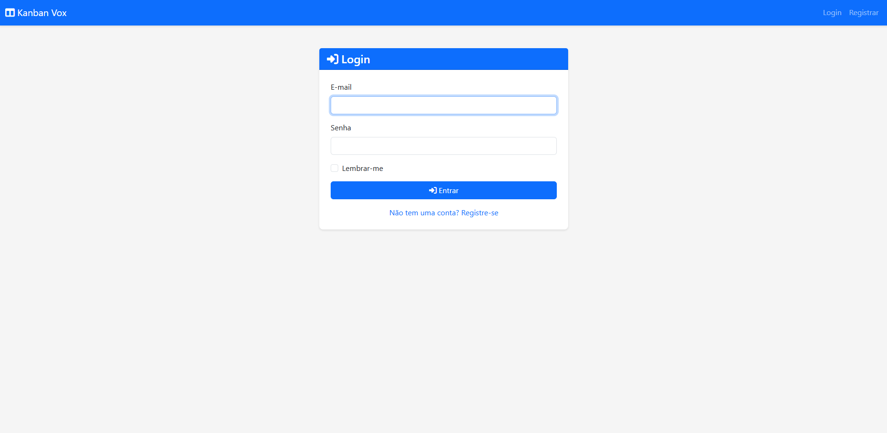
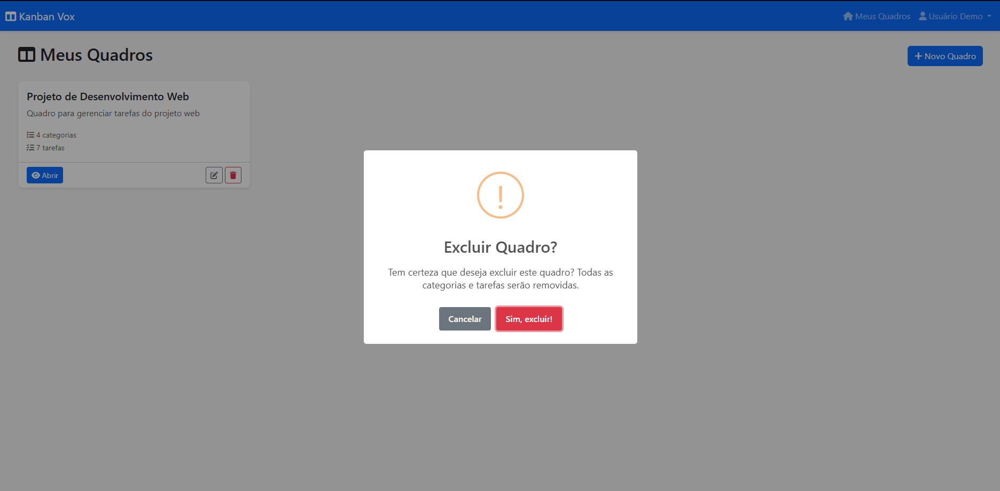
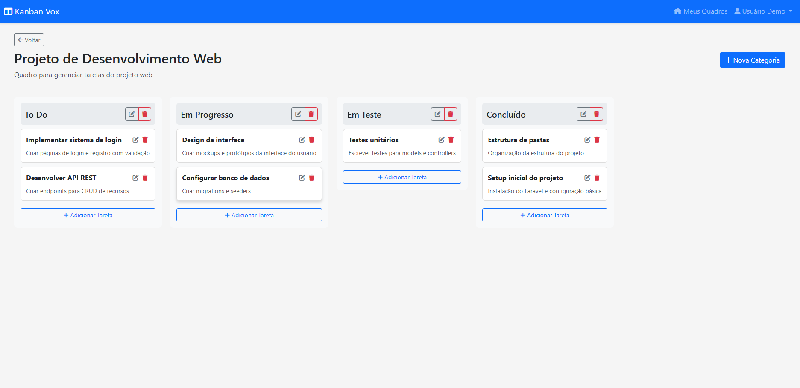
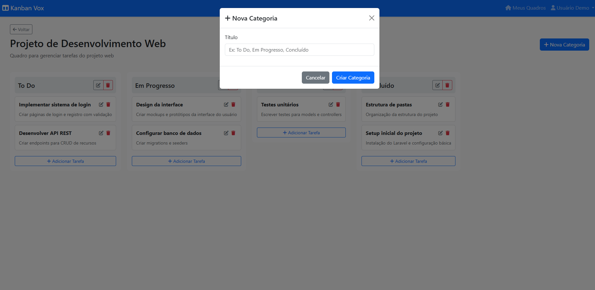
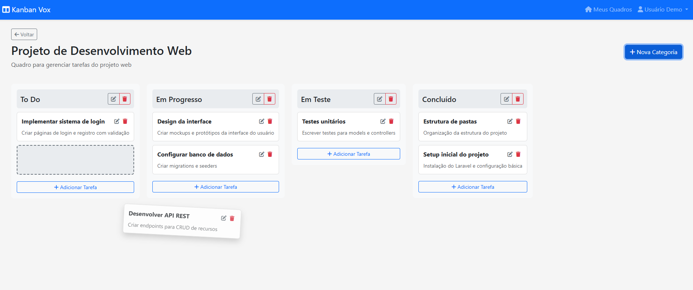
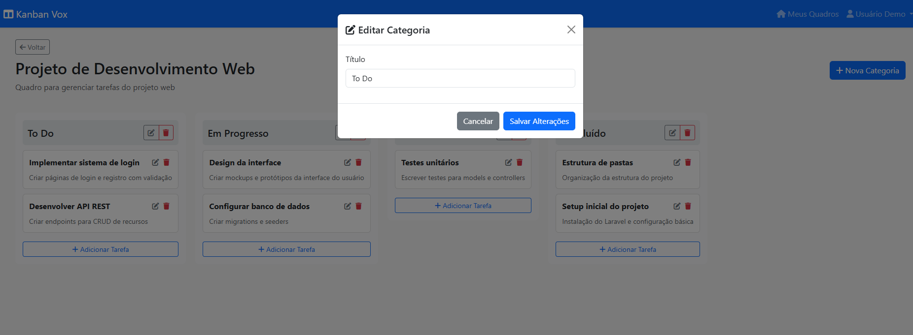
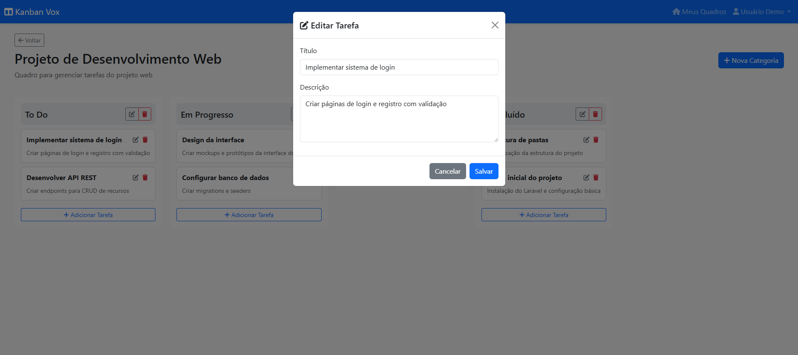
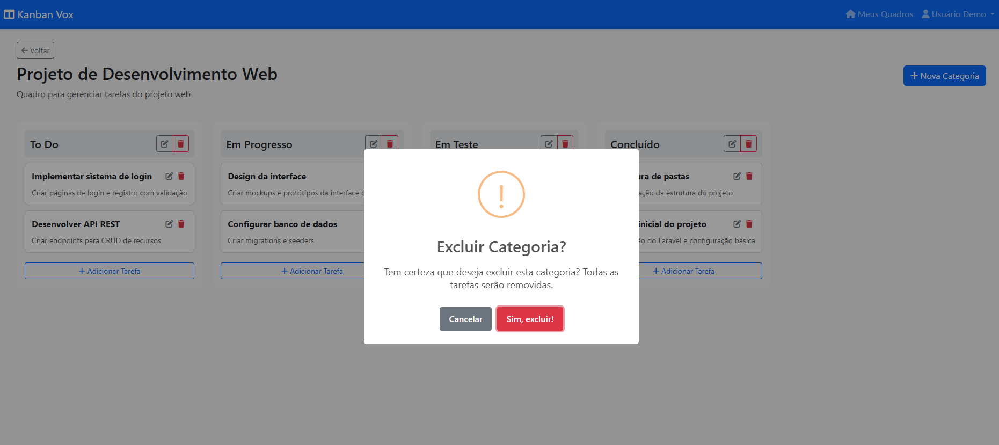
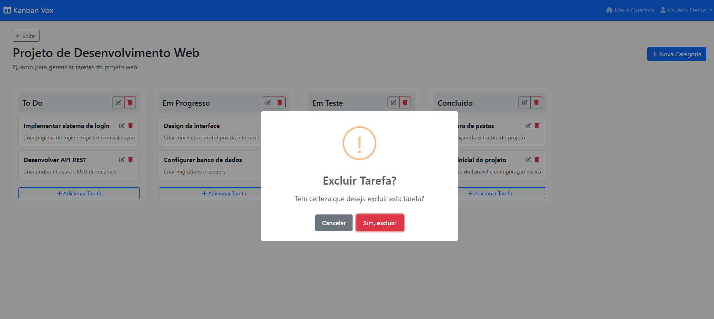

# Kanban Vox - Sistema de Gerenciamento de Tarefas

Sistema Kanban estilo Trello desenvolvido com Laravel 11, PHP 8.2+, PostgreSQL, Bootstrap 5 e jQuery.

## Características

- **Autenticação completa** com login/registro
- **Gerenciamento de Quadros (Boards)** - Crie e organize múltiplos quadros
- **Categorias personalizáveis** - Organize suas tarefas em categorias (To Do, In Progress, Done, etc.)
- **Tarefas com drag-and-drop** - Arraste e solte tarefas entre categorias
- **Interface responsiva** - Design moderno com Bootstrap 5
- **AJAX/jQuery** - Operações dinâmicas sem recarregar a página
- **Controle de permissões** - Cada usuário gerencia apenas seus próprios quadros

## Requisitos

- PHP 8.2 ou superior
- PostgreSQL
- Composer
- Node.js e NPM

## Instalação

1. **Clone o repositório ou navegue até o diretório do projeto**

2. **Instale as dependências do PHP**
```bash
composer install
```

3. **Configure o arquivo .env**
O arquivo .env já está configurado. Certifique-se de que o PostgreSQL está rodando e ajuste as credenciais se necessário:
```
DB_CONNECTION=pgsql
DB_HOST=127.0.0.1
DB_PORT=5432
DB_DATABASE=kanban_vox_tecnologia
DB_USERNAME=postgree
DB_PASSWORD=
```

4. **Crie o banco de dados**
```bash
# No PostgreSQL, crie o banco de dados:
psql -U root -c "CREATE DATABASE kanban_vox_tecnologia;"
```

5. **Execute as migrations**
```bash
php artisan migrate
```

6. **Instale o Laravel UI para autenticação**
```bash
composer require laravel/ui
php artisan ui bootstrap --auth
```

7. **Instale as dependências do Node.js**
```bash
npm install
```

8. **Compile os assets**
```bash
npm run build
```

9. **Inicie o servidor de desenvolvimento**
```bash
php artisan serve
```

10. **Acesse a aplicação**
Abra seu navegador e acesse: `http://localhost:8000`

## Estrutura do Projeto

### Backend
- **Models**: `Board`, `Category`, `Task`, `User`
- **Controllers**: `BoardController`, `CategoryController`, `TaskController`
- **Policies**: `BoardPolicy` para controle de acesso
- **Migrations**: Estrutura completa do banco de dados

### Frontend
- **Layouts**: Layout responsivo com Bootstrap 5
- **Views**: 
  - `boards/index.blade.php` - Lista de quadros
  - `boards/show.blade.php` - Visualização do quadro com drag-and-drop
  - `auth/*` - Páginas de login e registro
- **JavaScript**: jQuery com jQuery UI para drag-and-drop e AJAX

## Uso

### 1. Registrar/Login
- Acesse a aplicação e crie uma conta
- Faça login com suas credenciais

### 2. Criar um Quadro
- Clique em "Novo Quadro"
- Preencha o título e descrição
- Clique em "Criar Quadro"

### 3. Adicionar Categorias
- Dentro do quadro, clique em "Nova Categoria"
- Exemplos: "To Do", "In Progress", "Testing", "Done"

### 4. Criar Tarefas
- Em cada categoria, clique em "Adicionar Tarefa"
- Preencha o título e descrição da tarefa

### 5. Mover Tarefas
- Clique e arraste as tarefas entre as categorias
- As mudanças são salvas automaticamente

## Funcionalidades Implementadas

✅ Sistema de autenticação completo (login/registro/logout)
✅ CRUD completo de Quadros (Boards)
✅ CRUD completo de Categorias
✅ CRUD completo de Tarefas
✅ Drag and drop de tarefas entre categorias
✅ Controle de permissões (usuários só veem seus próprios quadros)
✅ Interface responsiva com Bootstrap 5
✅ Operações via AJAX sem recarregar a página
✅ Notificações toast para feedback do usuário
✅ Relacionamentos Eloquent entre modelos
✅ PostgreSQL como banco de dados

## Tecnologias Utilizadas

- **Backend**: Laravel 11, PHP 8.2+
- **Frontend**: Bootstrap 5, jQuery, jQuery UI
- **Banco de Dados**: PostgreSQL
- **ORM**: Eloquent
- **Autenticação**: Laravel UI

## Estrutura do Banco de Dados

### users
- id
- name
- email
- password
- timestamps

### boards
- id
- user_id (FK)
- title
- description
- timestamps

### categories
- id
- board_id (FK)
- title
- position
- timestamps

### tasks
- id
- category_id (FK)
- title
- description
- position
- timestamps

## API Endpoints

### Boards
- `GET /boards` - Listar quadros
- `POST /boards` - Criar quadro
- `GET /boards/{id}` - Visualizar quadro
- `PUT /boards/{id}` - Atualizar quadro
- `DELETE /boards/{id}` - Excluir quadro

### Categories
- `POST /boards/{id}/categories` - Criar categoria
- `PUT /categories/{id}` - Atualizar categoria
- `DELETE /categories/{id}` - Excluir categoria

### Tasks
- `POST /categories/{id}/tasks` - Criar tarefa
- `PUT /tasks/{id}` - Atualizar tarefa
- `DELETE /tasks/{id}` - Excluir tarefa
- `POST /tasks/{id}/move` - Mover tarefa entre categorias

## Desenvolvimento

### Executar em modo de desenvolvimento
```bash
# Terminal 1 - Servidor Laravel
php artisan serve

# Terminal 2 - Compilar assets em watch mode (opcional)
npm run dev
```

## Segurança

- Proteção CSRF em todas as requisições
- Senhas criptografadas com bcrypt
- Validação de dados no backend
- Controle de acesso baseado em políticas (Policies)
- Middleware de autenticação em todas as rotas protegidas

## Suporte

Para problemas ou dúvidas, consulte a documentação do Laravel: https://laravel.com/docs

---

## Imagens Demonstrativas do Projeto














Desenvolvido por Bruno Bernardo G. Freire
